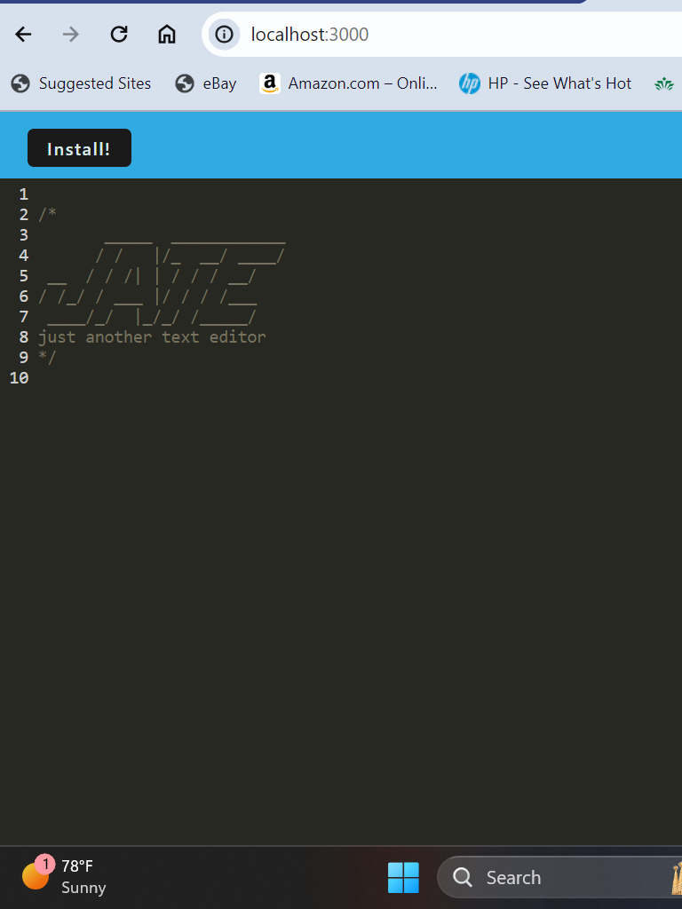

# text-editor


## Description

Thiss is a single-page application that creates and edits plain text files. It features multiple data persistence techniques that work with each other in case one of the options is not supported by the browser. This application also functions offline.

## Table of Contents

* [Visuals](#visuals)

* [Installation](#installation)

* [Usage](#usage)

* [Authors and acknowledgment](#authorsandacknowledgment)

* [Questions](questions)

## Visuals



## Installation

To install necessary dependencies, run the following command:

```
npm i
```

## Usage

- Requires Node v12+ (This app has only been tested on Node 20)
- Run npm install to download dependencies.
- Run npm run seed to seed the database.
- Run npm run start to initialize the app.

## Authors and Acknowledgement

This application was made based off a starter code from https://github.com/coding-boot-camp/cautious-meme.git. 

## Questions

If you have any questions or suggestions on how to improve the information on this page about, open an issue or contact me directly at Jay.are.sj@gmail.com. You can find more of my work at [Shanbeezy](https://github.com/Shanbeezy/).

